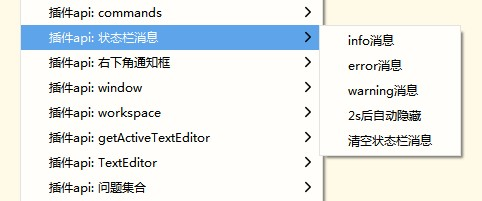

# HBuilderX插件扩展示例

本插件用于演示HBuilderX 各个API用法。

1. 建议您将本仓库克隆到本地，直接在HBuilderX内运行。
2. 下载此插件后，将目录拖到HBuilderX中，点击工具栏【运行】



#### 克隆仓库

```shell
git clone https://github.com/dcloudio/hbuilderx-extension-samples.git
```

